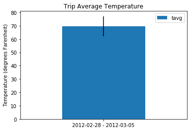

<<<<<<< HEAD
# Weather Stations

## Purpose
The database_engineering and data_engineering jupyter notebooks take csv files containing weather station measurments and create a sqlite database. That database was then queried using sqlalchemy to plot precipitation measurements, a histogram of temperature measuremnts, and a bar plot showing min, max, and average temperatures in a given date range.

app.py is a flask app that returns jsonified queries from the sqlite database. It can be used to return precipitation data, data about the weather stations, and temperature data. It can also be used to return the min, average, and max temperatures in a given date range.

## Requirements
This notebook requires python to be installed. Python 3.6.2 was used during development. The pandas library used to store and manipulate data. The matplotlib and numpy libraries were used to generate the plots showing the precipitation and temperature data. The jupyter library was used to execute the python code and display results. SQLAlchemy was used to create the databases and to query them. Flask was used to host the app to return the data in json format. All required libraries can be found in requirements.txt and installed with the following command: <br/>
<br/>
`pip install requirements.txt -r` <br/>
<br/>

## Running the Code
To run the notebooks enter the following into the command line: <br/>
<br/>
`$ jupyter notebook`<br/>
<br/>
Open up the desired notebook in your browser and then click the 'Kernal' and the 'Restart and run all option.' <br/>
<br/>
To run the flask app type the following into the command line: <br/>
<br/>
`python app.py` <br/>
<br/>
Copy the local address listed into your browser and use the specified routes to retrieve data.


## Results


```python
import pandas as pd
import matplotlib.pyplot as plt
import numpy as np
import datetime as dt
# Python SQL toolkit and Object Relational Mapper
import sqlalchemy
from sqlalchemy.ext.automap import automap_base
from sqlalchemy.orm import Session
from sqlalchemy import create_engine, func
```


```python
# Create engine using the `hawaii.sqlite` database file
engine = create_engine("sqlite:///hawaii.sqlite")
```


```python
# Declare a Base using `automap_base()`
Base = automap_base()
```


```python
# Use the Base class to reflect the database tables
Base.prepare(engine, reflect=True)
```


```python
# Assign the dow class to a variable called `Measurement`
Measurement = Base.classes.measurement
```


```python
# Assign the dow class to a variable called `Station`
Station = Base.classes.station
```


```python
# Create a session
session = Session(engine)
```


```python
#find date range to query
last = session.query(Measurement.date).order_by(Measurement.date.desc()).first()
last_date, = last
year,month,day = last_date.split('-')
query_date = dt.date(int(year),int(month),int(day)) - dt.timedelta(days=365)
print("Last Date Measured: ",last_date)
print("Query Date: ",query_date)
```

    Last Date Measured:  2017-08-23
    Query Date:  2016-08-23
    


```python
#query for last year's worth of precipitation data and save to dataframe
last_year_precip = pd.DataFrame(session.query(Measurement.date,Measurement.prcp).filter(Measurement.date>query_date).all())
last_year_precip = last_year_precip.set_index('date')
last_year_precip.head()
```


<div>
<table border="1" class="dataframe">
  <thead>
    <tr style="text-align: right;">
      <th></th>
      <th>prcp</th>
    </tr>
    <tr>
      <th>date</th>
      <th></th>
    </tr>
  </thead>
  <tbody>
    <tr>
      <th>2016-08-24</th>
      <td>0.08</td>
    </tr>
    <tr>
      <th>2016-08-25</th>
      <td>0.08</td>
    </tr>
    <tr>
      <th>2016-08-26</th>
      <td>0.00</td>
    </tr>
    <tr>
      <th>2016-08-27</th>
      <td>0.00</td>
    </tr>
    <tr>
      <th>2016-08-28</th>
      <td>0.01</td>
    </tr>
  </tbody>
</table>
</div>


```python
#plot last year's worth of precipitation data
last_year_precip.plot()
plt.title('Last 12 months of Precipitation Measurements')
plt.show()
```


```python
#print summary statistics
precip_mean = last_year_precip.mean()
precip_median = last_year_precip.median()
precip_mode = last_year_precip.mode()
precip_max = last_year_precip.max()
precip_min = last_year_precip.min()
print(f"The mean")
###################################################################################################
```

    The mean
    


```python
#find the number of weather stations
num_stations = session.query(Measurement.station).group_by(Measurement.station).count()
print(f'There are {num_stations} weather observation stations.')
```

    There are 9 weather observation stations.
    


```python
#find the number of observations for each station
station_observations = pd.DataFrame(session.query(Measurement.station,func.count(Measurement.station)).group_by(Measurement.station)\
    .order_by(func.count(Measurement.station).desc()).all(),columns=['Station','Number of Measurements'])
station_observations
```


<div>
<table border="1" class="dataframe">
  <thead>
    <tr style="text-align: right;">
      <th></th>
      <th>Station</th>
      <th>Number of Measurements</th>
    </tr>
  </thead>
  <tbody>
    <tr>
      <th>0</th>
      <td>USC00519281</td>
      <td>2772</td>
    </tr>
    <tr>
      <th>1</th>
      <td>USC00519397</td>
      <td>2724</td>
    </tr>
    <tr>
      <th>2</th>
      <td>USC00513117</td>
      <td>2709</td>
    </tr>
    <tr>
      <th>3</th>
      <td>USC00519523</td>
      <td>2669</td>
    </tr>
    <tr>
      <th>4</th>
      <td>USC00516128</td>
      <td>2612</td>
    </tr>
    <tr>
      <th>5</th>
      <td>USC00514830</td>
      <td>2202</td>
    </tr>
    <tr>
      <th>6</th>
      <td>USC00511918</td>
      <td>1979</td>
    </tr>
    <tr>
      <th>7</th>
      <td>USC00517948</td>
      <td>1372</td>
    </tr>
    <tr>
      <th>8</th>
      <td>USC00518838</td>
      <td>511</td>
    </tr>
  </tbody>
</table>
</div>


```python
#find the station with the most observations
station_most_observations = station_observations.iloc[0,0]
print(f'The station with the most observations is {station_most_observations} with {station_observations.iloc[0,1]} measurements.')
```

    The station with the most observations is USC00519281 with 2772 measurements.
    


```python
#query to get last 12 months of tobs data but filter by station with most observations
last_year_temp = pd.DataFrame(session.query(Measurement.date,Measurement.station,Measurement.tobs)\
                              .filter(Measurement.date>query_date).filter(Measurement.station==station_most_observations).all())
last_year_temp = last_year_temp.set_index('date')
last_year_temp.head()
```


<div>
<table border="1" class="dataframe">
  <thead>
    <tr style="text-align: right;">
      <th></th>
      <th>station</th>
      <th>tobs</th>
    </tr>
    <tr>
      <th>date</th>
      <th></th>
      <th></th>
    </tr>
  </thead>
  <tbody>
    <tr>
      <th>2016-08-24</th>
      <td>USC00519281</td>
      <td>77</td>
    </tr>
    <tr>
      <th>2016-08-25</th>
      <td>USC00519281</td>
      <td>80</td>
    </tr>
    <tr>
      <th>2016-08-26</th>
      <td>USC00519281</td>
      <td>80</td>
    </tr>
    <tr>
      <th>2016-08-27</th>
      <td>USC00519281</td>
      <td>75</td>
    </tr>
    <tr>
      <th>2016-08-28</th>
      <td>USC00519281</td>
      <td>73</td>
    </tr>
  </tbody>
</table>
</div>


```python
last_year_temp.hist(column='tobs',bins=12)
plt.xlabel('Temperature (degrees Farenheit)')
plt.ylabel('Frequency')
plt.title(f'Histogram of Temperature Measurements for Station {station_most_observations}')
plt.show()
```


```python
# Write a function called `calc_temps` that will accept start date and end date in the format '%Y-%m-%d' 
# and return the minimum, average, and maximum temperatures for that range of dates
def calc_temps(start_date, end_date):
    # TMIN, TAVG, and TMAX for a list of dates.
    #Args: start_date (string): A date string in the format %Y-%m-%d
    #    end_date (string): A date string in the format %Y-%m-%d
    #Returns: TMIN, TAVE, and TMAX"""
    return session.query(func.min(Measurement.tobs), func.avg(Measurement.tobs), func.max(Measurement.tobs)).\
    filter(Measurement.date >= start_date).filter(Measurement.date <= end_date).all()
```


```python
start_date = '2012-02-28'
end_date = '2012-03-05'
date_range = start_date + ' - ' + end_date
tmin,tavg,tmax = calc_temps(start_date, end_date)[0]
tavg_df=pd.DataFrame([tavg],columns=['tavg'],index=[date_range])
```


```python
tavg_df.plot(kind='bar',yerr=[[tavg-tmin],[tmax-tavg]])
plt.xticks(rotation='horizontal')
plt.ylabel('Temperature (degrees Farenheit)')
plt.title('Trip Average Temperature')
plt.show()
```




=======
# Weather-Station-Data
>>>>>>> c48a46150d236cea866d0e1fb6cc801f58f83284
